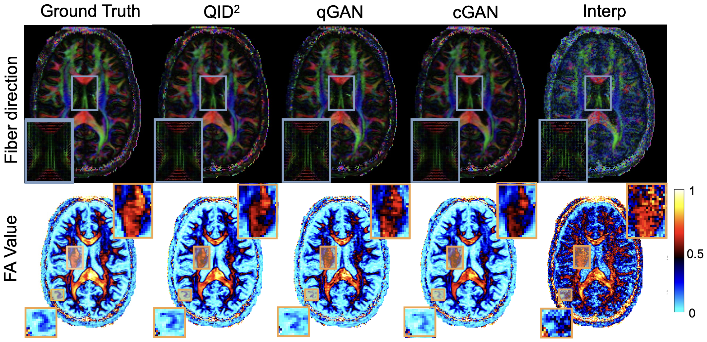

<div align="center">  

## QID^2: An Image-Conditioned Diffusion Model for $Q$-space Up-sampling of DWI Data

[](https://arxiv.org/pdf/2409.02309)
</div>
Reference Implementation of paper "An Image-Conditioned Diffusion Model for $Q$-space Up-sampling of DWI Data" of Zijian Chen*, Jueqi Wang*, Archana Venkataraman (* equal contribution), to appear in MICCAI 2024 International Workshop on Computational Diffusion MRI.
<p align="center">
    
</p>

## Method


## Results
### Qualitative Results

### Quantitative Results


## Citation
If any of the results in this paper or code are useful for your research, please cite the corresponding paper:
```
@article{chen2024qid,
  title={QID $\^{} 2$: An Image-Conditioned Diffusion Model for Q-space Up-sampling of DWI Data},
  author={Chen, Zijian and Wang, Jueqi and Venkataraman, Archana},
  journal={arXiv preprint arXiv:2409.02309},
  year={2024}
}
```
